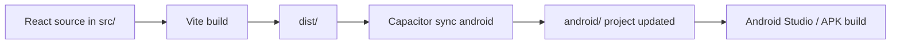

# Android Documentation

## Why Capacitor Exists In This Project

Capacitor lets the same React app run inside an Android shell.

Simple explanation:

- The web app stays in React.
- Capacitor wraps that web app in a native Android project.
- This avoids rewriting the UI in Kotlin or Java.

Technical explanation:

- Capacitor serves the built frontend inside an Android WebView.
- It also exposes native APIs like filesystem access and platform detection.

## What The `android/` Folder Contains

The `android/` folder is the native Android project generated for this app.

It contains:

- Gradle build files.
- Android manifest files.
- Resource folders for icons, splash images, and themes.
- The native `MainActivity` entry point.
- Capacitor plugin wiring.

## Build Flow

In plain language:

1. React code is bundled by Vite.
2. The production build is written to `dist/`.
3. Capacitor copies the web build into the Android project.
4. Android Studio or Gradle builds the final APK.

## What Gets Copied From React Into Android

During Capacitor sync, the built frontend assets are copied into the native app’s web asset area.

That includes:

- The bundled JavaScript.
- The compiled CSS.
- The HTML entry file.
- Static assets such as fonts and images that Vite includes in the build.

This is why the frontend build output matters so much for Android packaging.

## Important Capacitor And Android Files

| File | What it does |
|---|---|
| `capacitor.config.ts` | Declares the app id, app name, and `webDir`. |
| `android/build.gradle` | Top-level Android build configuration. |
| `android/settings.gradle` | Includes the Android modules. |
| `android/variables.gradle` | Stores Android version numbers and shared dependency versions. |
| `android/gradle.properties` | Gradle tuning and AndroidX settings. |
| `android/capacitor.settings.gradle` | Generated plugin include file. |
| `android/app/build.gradle` | App module build config and plugin wiring. |
| `android/app/src/main/AndroidManifest.xml` | App permissions, activity, and file provider setup. |
| `android/app/src/main/java/com/vintagephotobooth/app/MainActivity.java` | Native entry point that loads the WebView. |
| `android/app/src/main/res/xml/file_paths.xml` | File provider paths used when saving or sharing files. |
| `android/app/src/main/res/values/strings.xml` | App label and package strings. |
| `android/app/src/main/res/values/styles.xml` | Native theme and splash screen styling. |
| `android/gradlew` and `android/gradlew.bat` | Wrapper scripts for consistent Gradle versions. |
| `android/gradle/wrapper/gradle-wrapper.properties` | Declares which Gradle version the wrapper downloads. |

## Native Feature Access

The frontend accesses native features through Capacitor plugins and platform checks.

### Filesystem Save

The camera page uses `@capacitor/filesystem` to write the finished PNG to Android storage.

### Platform Detection

The app checks `Capacitor.isNativePlatform()` so it can disable heavy visual overlays in the native WebView.

### Share Plugin

The repository includes `@capacitor/share` in dependencies, so native sharing can be added without changing the Android shell.

### File Provider

`file_paths.xml` and the manifest provider setup allow the Android app to expose files correctly when saving or sharing.

## Android Resources

Android uses a standard resource structure:

- Launcher icons live in `mipmap-*` folders.
- Splash assets live in `drawable-*` folders.
- Themes and strings live in `values/`.
- File provider rules live in `xml/`.

## Why Some Effects Are Reduced On Android

The project disables some heavy overlays in native mode because Android WebView can struggle with expensive animated layers.

That tradeoff keeps the camera preview smooth.
