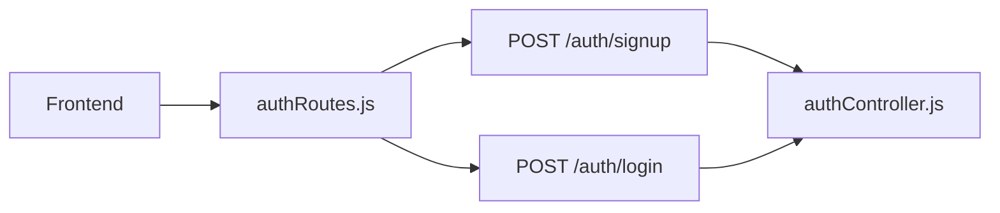

# Backend Documentation

## Backend Architecture

The backend is a small Node.js and Express API. It exists to handle authentication and MongoDB user storage.

Main layers:

- `server.js` starts the app.
- `config/db.js` connects to MongoDB.
- `routes/authRoutes.js` maps HTTP endpoints.
- `controllers/authController.js` contains the business logic.
- `models/User.js` defines the MongoDB user schema.
- `middleware/` holds error and environment checks.

## Backend Folder And File Guide

| File or folder | What it does |
|---|---|
| `backend/server.js` | Bootstraps Express, connects to MongoDB, and starts listening. |
| `backend/config/db.js` | Creates the MongoDB connection. |
| `backend/controllers/authController.js` | Signup and login handlers. |
| `backend/middleware/errorMiddleware.js` | 404 and error response handling. |
| `backend/middleware/validateEnv.js` | Checks required environment variables. |
| `backend/models/User.js` | Mongoose model for users. |
| `backend/routes/authRoutes.js` | Auth routes for signup and login. |
| `backend/package.json` | Backend scripts and dependencies. |
| `backend/package-lock.json` | Locked dependency versions. |
| `backend/README.md` | Setup notes and quick backend summary. |
| `backend/.env.example` | Example environment file template. |
| `backend/.gitignore` | Ignores local backend-only files. |

## Express Server Lifecycle

```mermaid
flowchart TD
    A[Load env vars] --> B[validateEnv()]
    B --> C[connectDB()]
    C --> D[Create Express app]
    D --> E[Register cors and json middleware]
    E --> F[Register routes]
    F --> G[Register 404 and error middleware]
    G --> H[app.listen(PORT)]
```

Simple version:

1. Load environment variables with `dotenv`.
2. Validate that required values exist.
3. Connect to MongoDB.
4. Create the Express app.
5. Add middleware.
6. Register routes.
7. Start listening on the configured port.

## Route Flow

All auth routes are mounted under `/auth`.



## Controller Flow

`authController.js` handles the actual business logic.

### Signup Flow

1. Read `name`, `email`, and `password` from the request body.
2. Validate required fields.
3. Validate email format.
4. Check password length.
5. Search for an existing user by email.
6. Hash the password with `bcryptjs`.
7. Create the new user document.
8. Sign a JWT.
9. Return the user profile and token.

### Login Flow

1. Read `email` and `password` from the request body.
2. Validate required fields.
3. Find the user document by email.
4. Compare the password with the stored hash.
5. Sign a JWT.
6. Return the user profile and token.

## MongoDB Connection Flow

`db.js` performs the database connection.

```mermaid
flowchart TD
    A[MONGO_URI from env] --> B[Normalize credentials if needed]
    B --> C[mongoose.connect()]
    C --> D[MongoDB Atlas cluster]
```

The project uses `MONGO_URI` from environment variables. That URI should point to a MongoDB Atlas cluster or another MongoDB host.

## JWT Generation And Validation Flow

JWT creation happens in the auth controller:

- Payload: the user id.
- Secret: `JWT_SECRET`.
- Expiration: `7d`.

Validation is not fully implemented as a request guard in this repository. The frontend stores the token, but there is no protected backend route or token verification middleware yet.

## Environment Variable Usage

| Variable | Used for |
|---|---|
| `PORT` | HTTP port for the Express server. |
| `MONGO_URI` | MongoDB connection string. |
| `JWT_SECRET` | JWT signing secret. |
| `NODE_ENV` | Changes error output behavior. |

## Middleware Usage

### `cors()`

Allows the frontend to talk to the backend. Right now it is open to all origins.

### `express.json()`

Parses JSON request bodies.

### `validateEnv()`

Stops startup if required environment variables are missing.

### `notFound`

Converts unknown routes into a 404 error.

### `errorHandler`

Returns a consistent JSON error response.

## API Endpoints

### `GET /`

Purpose: health check.

Request body: none.

Response body:

```json
{ "message": "Auth API is running" }
```

Status codes:

- `200 OK`

Example request:

```bash
curl http://localhost:5000/
```

Example response:

```json
{ "message": "Auth API is running" }
```

### `POST /auth/signup`

Purpose: create a new user.

Request body:

```json
{
  "name": "Jane Doe",
  "email": "jane@example.com",
  "password": "securepassword123"
}
```

Response body:

```json
{
  "user": {
    "id": "64bf1d0a5f973c1d94efb12a",
    "name": "Jane Doe",
    "email": "jane@example.com"
  },
  "token": "eyJhbGciOi..."
}
```

Status codes:

- `201 Created` when signup succeeds.
- `400 Bad Request` when required fields are missing or invalid.
- `409 Conflict` when the email already exists.
- `500 Internal Server Error` for unexpected errors.

Example request:

```bash
curl -X POST http://localhost:5000/auth/signup \
  -H "Content-Type: application/json" \
  -d "{\"name\":\"Jane Doe\",\"email\":\"jane@example.com\",\"password\":\"securepassword123\"}"
```

### `POST /auth/login`

Purpose: authenticate an existing user.

Request body:

```json
{
  "email": "jane@example.com",
  "password": "securepassword123"
}
```

Response body:

```json
{
  "user": {
    "id": "64bf1d0a5f973c1d94efb12a",
    "name": "Jane Doe",
    "email": "jane@example.com"
  },
  "token": "eyJhbGciOi..."
}
```

Status codes:

- `200 OK` when login succeeds.
- `400 Bad Request` when required fields are missing.
- `401 Unauthorized` when credentials do not match.
- `500 Internal Server Error` for unexpected errors.

Example request:

```bash
curl -X POST http://localhost:5000/auth/login \
  -H "Content-Type: application/json" \
  -d "{\"email\":\"jane@example.com\",\"password\":\"securepassword123\"}"
```

## Error Handling Flow

```mermaid
flowchart TD
    A[Route or controller error] --> B[Route next(error)]
    B --> C[errorHandler]
    C --> D[JSON error response]
```

The controller functions use `next(error)` so unexpected failures are passed into the Express error middleware. That keeps the API responses consistent.
