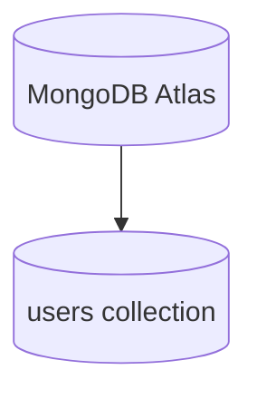

# Database Documentation

## MongoDB Atlas Setup

This project uses MongoDB through a connection string in `MONGO_URI`.

Simple explanation:

- MongoDB Atlas is a cloud-hosted MongoDB service.
- The backend connects to that service with a URI.
- The repository does not include a local MongoDB server.

Technical explanation:

- `backend/config/db.js` reads `MONGO_URI`.
- The URI is normalized and then passed to `mongoose.connect()`.
- If the connection fails, the backend exits early.

## Database Structure

The database is very small and focused on authentication.



## Collections

At the moment the project uses one main collection:

- `users`

This collection stores account information needed for signup and login.

## Mongoose Model

The model lives in `backend/models/User.js`.

### User Schema

| Field | Type | Rules | Purpose |
|---|---|---|---|
| `name` | String | required, trimmed | User display name. |
| `email` | String | required, unique, lowercase, trimmed | Login identifier. |
| `password` | String | required | Hashed password, not the plain text password. |

### Timestamps

The schema uses `timestamps: true`, so MongoDB automatically stores:

- `createdAt`
- `updatedAt`

## Indexes

The important index in this project is the unique index on `email`.

Why it matters:

- It prevents duplicate accounts with the same email.
- It makes email lookups efficient.

No custom compound indexes are defined in the current code.

## Validation Rules

Validation happens in two places:

1. In the backend controller before the document is created.
2. In the schema through required fields and uniqueness rules.

Validation behavior:

- Name is required.
- Email is required and must look like an email.
- Password is required and must meet the controller’s minimum length.
- Email is stored in lowercase and trimmed.
- Name is trimmed.

## How Signup Creates A Document

Signup flow:

1. The frontend sends name, email, and password.
2. The controller validates the fields.
3. The controller checks whether the email already exists.
4. The password is hashed with bcrypt.
5. `User.create()` inserts the document into MongoDB.
6. The backend returns the public user data and a JWT.

Important detail:

- The stored password is the hash, not the original password.

## How Login Queries The Database

Login flow:

1. The frontend sends email and password.
2. The controller normalizes the email.
3. `User.findOne({ email })` looks up the record.
4. The controller compares the supplied password to the stored hash.
5. If the password matches, a JWT is created.

## Example Documents

### User Document After Signup

```json
{
  "_id": "64bf1d0a5f973c1d94efb12a",
  "name": "Jane Doe",
  "email": "jane@example.com",
  "password": "$2a$10$hashedPasswordValueHere",
  "createdAt": "2026-07-11T10:30:00.000Z",
  "updatedAt": "2026-07-11T10:30:00.000Z",
  "__v": 0
}
```

### Public Response Sent To The Frontend

```json
{
  "user": {
    "id": "64bf1d0a5f973c1d94efb12a",
    "name": "Jane Doe",
    "email": "jane@example.com"
  },
  "token": "eyJhbGciOiJIUzI1NiIsIn..."
}
```

Notice that the password is not returned to the frontend.
