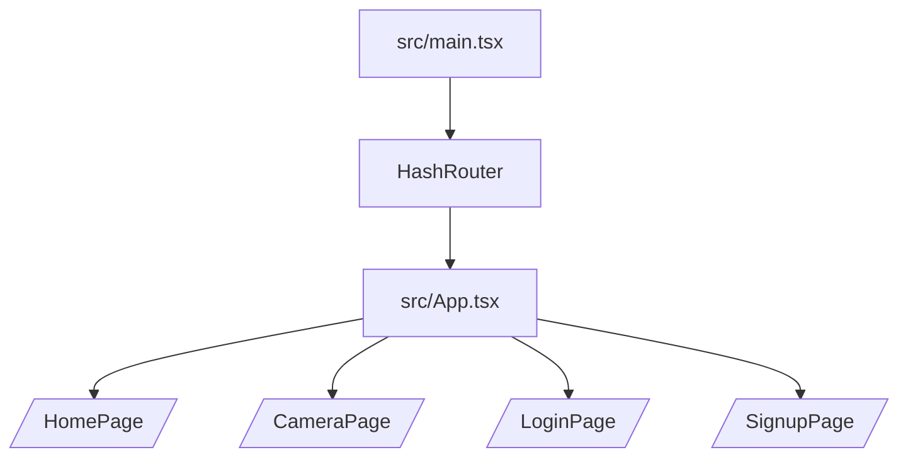
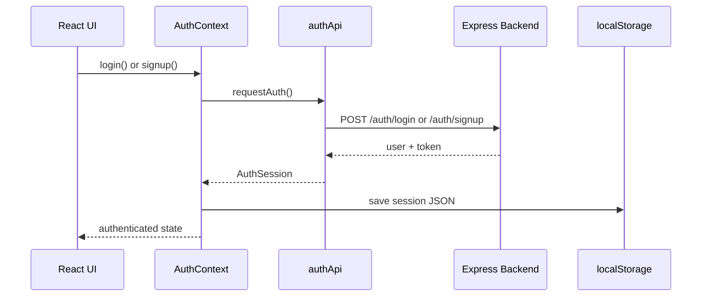
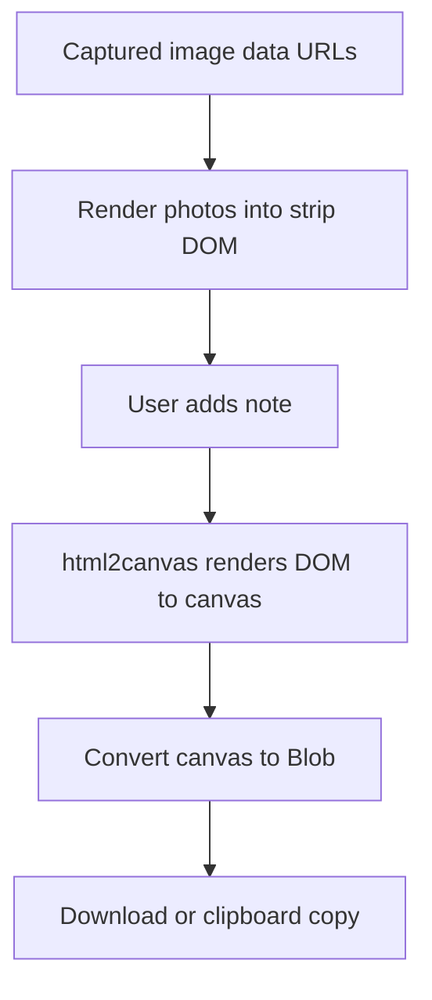
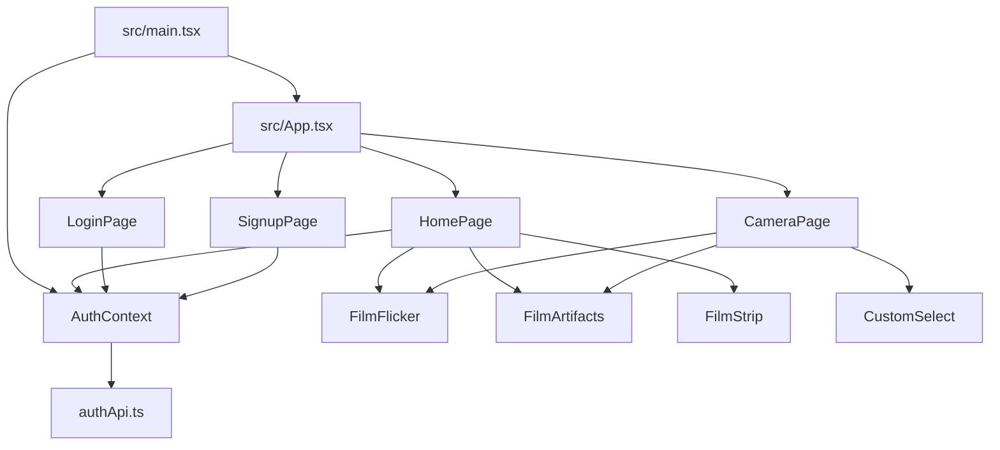

# Frontend Documentation

## Frontend Architecture

The frontend is a React single-page app written in TypeScript. The app starts in `src/main.tsx`, which mounts React into `index.html`, wraps the app in `AuthProvider`, and enables `HashRouter` for routing.

The frontend is organized into:

- `src/main.tsx` for startup.
- `src/App.tsx` for routes.
- `src/auth/` for session and API logic.
- `src/pages/` for page screens.
- `src/components/` for reusable UI parts.
- `src/index.css` for global styling and animations.

## Folder And File Guide For `src/`

| File or folder | What it does |
|---|---|
| `src/main.tsx` | React entry point. Creates the root app, adds `AuthProvider`, and turns on `HashRouter`. |
| `src/App.tsx` | Defines the routes for `/`, `/camera`, `/login`, and `/signup`. |
| `src/index.css` | Global styles, custom font loading, and animation keyframes. |
| `src/vite-env.d.ts` | Vite type definitions for TypeScript. |
| `src/auth/` | Authentication logic, types, and API requests. |
| `src/auth/AuthContext.tsx` | Keeps the current session in React context. |
| `src/auth/authApi.ts` | Sends login/signup requests to the backend. |
| `src/auth/authTypes.ts` | Shared auth-related TypeScript types. |
| `src/components/` | Shared UI components used by multiple pages. |
| `src/components/CustomSelect.tsx` | Custom dropdown used on the camera page. |
| `src/components/FilmStrip.tsx` | Decorative sprocket-hole border overlay. |
| `src/components/FilmFlicker.tsx` | Grain and flicker overlay. |
| `src/components/FilmArtifacts.tsx` | Dust, scratch, and scan-line overlay. |
| `src/pages/HomePage.tsx` | Home screen. |
| `src/pages/CameraPage.tsx` | Camera workflow and photo strip builder. |
| `src/pages/LoginPage.tsx` | Login form screen. |
| `src/pages/SignupPage.tsx` | Signup form screen. |

## Routing Flow

The app uses React Router v6.

Why `HashRouter` is used:

- Capacitor loads the app from a local file-like environment.
- Hash-based routes avoid server rewrite requirements.
- This makes the same frontend work in both the browser and Android WebView.

## State Management

The frontend uses three kinds of state:

1. Local component state with `useState`.
2. Shared authentication state with React Context.
3. DOM references with `useRef`.

### Local State

`HomePage`, `LoginPage`, `SignupPage`, and `CameraPage` each keep their own page-specific values such as form inputs, countdown timers, camera state, and captured images.

### Shared Auth State

`AuthContext.tsx` stores:

- The current user.
- The current token.
- A status value such as `loading`, `authenticated`, or `anonymous`.

It also exposes `login`, `signup`, and `logout` methods.

### Refs

The camera page uses refs for:

- The `<video>` element.
- The hidden `<canvas>` element.
- The photo strip container.
- The hidden text measurement span.

## Authentication Flow

Simple version:

1. The user fills in the login or signup form.
2. The page calls the auth context method.
3. The context calls the API helper.
4. The backend returns a user and token.
5. The frontend stores the session in localStorage and marks the user as logged in.

## Camera Flow

`CameraPage.tsx` is the most complex frontend file. Its flow is:

1. Request webcam access with `navigator.mediaDevices.getUserMedia`.
2. Attach the stream to the `<video>` preview.
3. Let the user choose a filter, timer, photo count, and camera facing mode.
4. Wait for the countdown if one is enabled.
5. Draw each video frame into a hidden canvas.
6. Convert the canvas to a PNG data URL.
7. Store the captured images in React state.
8. Show the result view with the film strip.

## Filter System

The filter selector uses CSS filter strings. These are applied to the live video preview and to the captured canvas frame.

Supported filter values:

- `none`
- `grayscale(100%)`
- `sepia(100%)`
- `invert(100%)`
- `blur(3px)`
- `contrast(200%)`

The filter system is simple because it uses native browser rendering instead of a custom image-processing library.

## Photo Strip Generation Flow

The photo strip is a DOM element, not just an array of images. That matters because the app wants the final export to include:

- The photos.
- The film-strip styling.
- The custom note.
- The borders and spacing.

`html2canvas` captures that DOM into one final image.

## Download Flow

The download flow has two branches:

- Web: create an object URL and click a temporary anchor.
- Android: convert the Blob to a data URL and write it with Capacitor Filesystem.

If the main download fails, the code falls back to downloading the individual captured images.

## Important React Concepts Used Here

| Concept | How this project uses it |
|---|---|
| Components | Each screen and shared UI piece is a component. |
| Props | Shared visual components receive small inputs such as `side` or `label`. |
| State | Forms, camera status, and captured photos all live in component state. |
| Context | Auth state is shared without prop drilling. |
| Hooks | `useState`, `useEffect`, `useRef`, `useMemo`, and `useContext` are central to the app. |
| Conditional rendering | The UI switches between camera mode and result mode depending on state. |
| Controlled inputs | Login, signup, and note fields use React state as the source of truth. |
| Effects | Camera startup, cleanup, and overlay animation logic run in effects. |
| Dynamic import | `html2canvas` is loaded only when exporting to keep the initial bundle lighter. |

## Component Dependency Diagram

## Component Reference

### `src/main.tsx`

- What it does: bootstraps the app.
- Props: none.
- State: none.
- Used by: the browser and Capacitor WebView.

### `src/App.tsx`

- What it does: declares app routes.
- Props: none.
- State: none.
- Used by: `main.tsx`.

### `AuthContext.tsx`

- What it does: stores auth session state and exposes auth actions.
- Props: `children`.
- State: session, status.
- Used by: `main.tsx`, `HomePage`, `LoginPage`, `SignupPage`.

### `authApi.ts`

- What it does: calls the backend auth endpoints and normalizes the response.
- Props: none.
- State: none.
- Used by: `AuthContext.tsx`.

### `HomePage.tsx`

- What it does: landing page with the main call to action.
- Props: none.
- State: none of its own, but it reads auth context.
- Used by: the `/` route.

### `CameraPage.tsx`

- What it does: webcam preview, capture, photo strip creation, download, and copy actions.
- Props: none.
- State: stream, filter, timer, photo count, countdown, captured images, note, download status, camera facing, and more.
- Used by: the `/camera` route.

### `LoginPage.tsx`

- What it does: shows the login form.
- Props: none.
- State: email, password, error message, submitting status.
- Used by: the `/login` route.

### `SignupPage.tsx`

- What it does: shows the signup form.
- Props: none.
- State: name, email, password, error message, submitting status.
- Used by: the `/signup` route.

### `CustomSelect.tsx`

- What it does: provides a styled dropdown.
- Props: `value`, `onChange`, `options`, `disabled?`, `label`.
- State: `isOpen`.
- Used by: `CameraPage`.

### `FilmStrip.tsx`

- What it does: draws decorative sprocket-hole film borders.
- Props: `side` (`left`, `right`, `top`, `bottom`).
- State: none.
- Used by: `HomePage`.

### `FilmFlicker.tsx`

- What it does: renders grain, vignette, and subtle flicker overlays.
- Props: none.
- State: opacity.
- Used by: `HomePage` and `CameraPage` on web.

### `FilmArtifacts.tsx`

- What it does: generates scratches, dust, and scan lines.
- Props: none.
- State: scratches, dust, and a nested horizontal-line state.
- Used by: `HomePage` and `CameraPage` on web.
