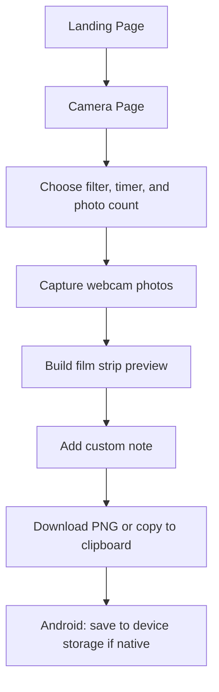
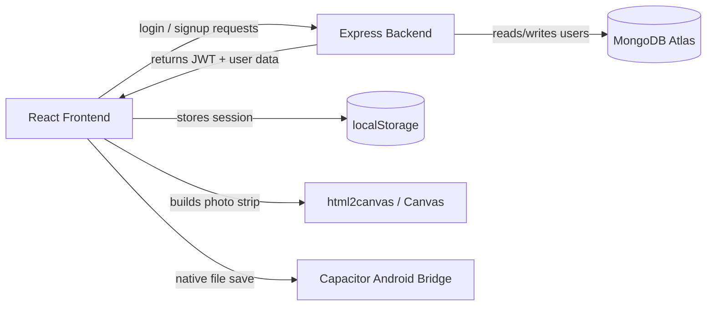

# Project Overview

Vintage Photobooth is a full-stack photo booth application. It lets a user open a landing page, go to the camera screen, capture one to four webcam photos, decorate the result with a retro film style, and download or copy the finished strip.

The app is split into two main parts:

- The frontend is a React single-page app.
- The backend is an Express API connected to MongoDB.

Capacitor wraps the frontend so the same web app can also run as an Android app.

## What The Project Does

At a high level, the app recreates a vintage analog photobooth:

- The landing page introduces the project and sends the user into the camera flow.
- The camera page shows a live webcam preview.
- The user can pick a filter, choose a timer, and decide how many photos to take.
- The app captures the images into a film-strip layout.
- The user can add a handwritten-style note.
- The finished strip can be downloaded as a PNG or copied to the clipboard.
- On Android, the finished file can also be written to device storage through Capacitor.

## User Flow

Simple version:

1. The user opens the home page.
2. The user clicks Capture Photo.
3. The app opens the camera experience.
4. The user sets the effect options and takes photos.
5. The app renders those photos into a stylized film strip.
6. The user downloads or copies the final image.

## Major Features

### Home Screen

The home page is the project’s entry point. It shows the vintage theme, lets the user start the camera flow, and also gives access to login and signup.

### Camera Capture

The camera page connects to the device webcam with the browser camera API. It supports:

- Front or rear camera selection.
- A countdown timer.
- Capturing 1 to 4 photos in sequence.
- A flash effect during capture.

### Vintage Filters and Film Effects

The live camera preview can be styled with simple CSS filters such as grayscale, sepia, invert, blur, and high contrast. The app also uses decorative film overlays like grain, dust, scratches, and sprocket-hole borders.

### Photo Strip Builder

After capture, the app places the photos into a vertical film-strip layout. The user can type a note below the photos, and the app checks the text width so the note does not break the design.

### Export and Download

The final film strip is rendered into a PNG image with `html2canvas`. On the web, the image downloads normally. On Android, Capacitor’s filesystem plugin saves the file to device storage.

### Authentication

The project includes signup and login screens. The frontend stores the session in browser localStorage, and the backend signs a JWT token after validating the user.

### Android Integration

Capacitor turns the web app into an Android app shell. The native project loads the frontend bundle, exposes Android permissions, and lets the app write files directly on Android devices.

## How The Pieces Work Together

### Frontend

The React app handles the visible interface, routing, camera preview, capture logic, animations, and export buttons.

### Backend

The Express API handles account creation and login. It validates input, hashes passwords, looks up users in MongoDB, and generates JWTs.

### MongoDB

MongoDB stores user accounts. The project uses a `User` collection with fields for name, email, and password.

### JWT Authentication

JWT stands for JSON Web Token. After login or signup, the backend signs a token and returns it to the frontend. The frontend stores the token with the user profile so the session can be restored later.

### Android Integration

Capacitor provides the bridge between the web code and the Android shell. That is how the app can save files to Android storage and run as a packaged mobile app.

## Why This Architecture Was Chosen

- React keeps the UI component-based and easy to maintain.
- Vite makes development fast.
- Express keeps the backend lightweight.
- MongoDB stores flexible user documents.
- Capacitor reuses the web app for Android instead of rewriting it in a native language.
