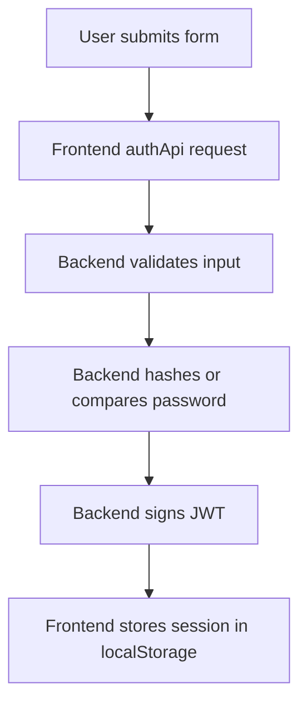

# Security Documentation

## Authentication Security Basics

This project uses JWT-based authentication and password hashing.

### JWT Usage

JWT stands for JSON Web Token.

Simple explanation:

- The backend creates a signed token after login or signup.
- The frontend stores that token with the session.
- The token can later identify the user.

Technical explanation:

- The token payload contains the user id.
- The signing secret comes from `JWT_SECRET`.
- The current token lifetime is `7d`.

### Password Hashing

Passwords are never stored in plain text.

Flow:

1. The frontend sends the password over HTTPS or local development HTTP.
2. The backend creates a salt with bcrypt.
3. The backend hashes the password.
4. The hash is stored in MongoDB.
5. Login compares the candidate password to the stored hash.

## Environment Variables

Environment variables keep secrets and deployment values out of application code.

Important variables in this project:

- `MONGO_URI`
- `JWT_SECRET`
- `PORT`
- `NODE_ENV`
- `VITE_API_BASE_URL`

Why this matters:

- Secrets should not be hardcoded in source files.
- Different environments can use different settings.
- The same code can run locally and in production.

## MongoDB Credentials

The MongoDB connection string contains credentials.

Security rule:

- Treat `MONGO_URI` as a secret.
- Keep it in a local or deployment environment file.
- Do not commit real credentials to Git.

## CORS Configuration

The backend currently uses open CORS:

- `app.use(cors())`

What that means:

- Any origin can call the API.
- That is convenient for development.
- It is not ideal for a locked-down production deployment.

## Current Authentication Flow

## Current Security Weaknesses

This codebase works, but it still has several security gaps:

1. Tokens are stored in `localStorage`, which is vulnerable if the page ever gets an XSS issue.
2. CORS is wide open instead of being limited to trusted origins.
3. There is no token refresh or revocation system.
4. There is no backend middleware that validates JWTs on protected routes because protected routes do not exist yet.
5. There is no login rate limiting in the backend.
6. Signup and login are not protected by account lockout logic.
7. The app does not currently enforce route protection in the frontend.

## Practical Safety Notes

- Use a strong, random `JWT_SECRET`.
- Rotate MongoDB credentials if they are ever exposed.
- Prefer environment variables over hardcoded secrets.
- Restrict CORS before production deployment.
- Move token storage to safer patterns if the app grows beyond a learning project.
