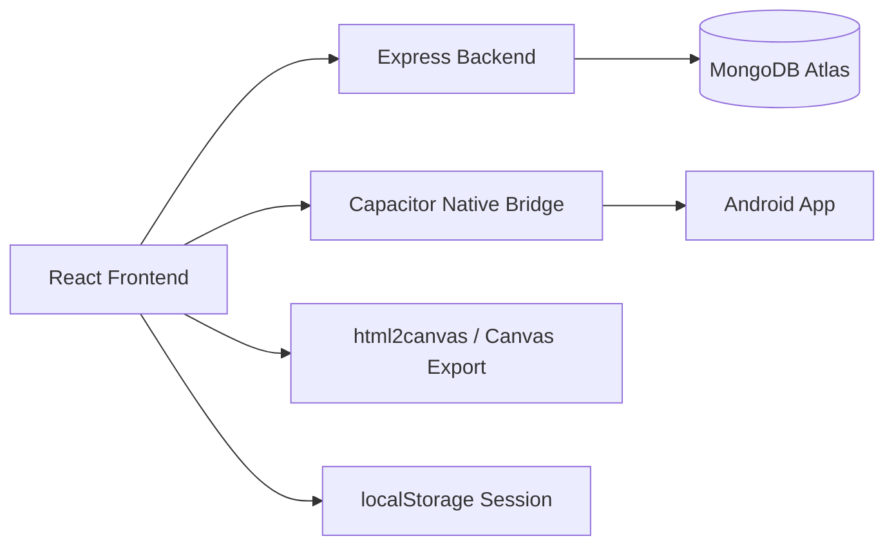
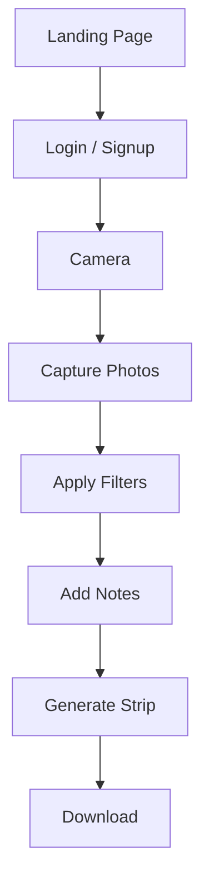
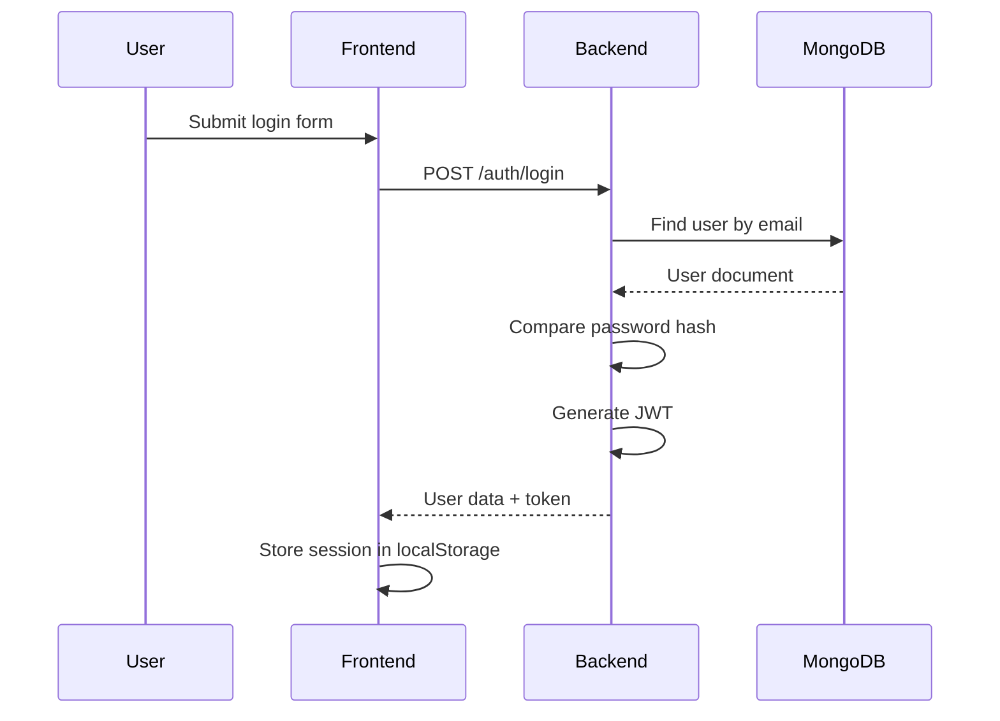
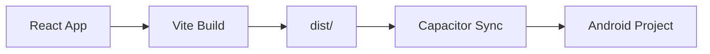

# Vintage Photobooth

Vintage Photobooth is a full-stack web application that recreates the look and feel of a classic analog photobooth. Users can open the landing page, sign in or create an account, capture one to four webcam photos, apply vintage filters, add a handwritten-style note, and download the result as a film-strip PNG.

The project is built with React, TypeScript, and Vite on the frontend, Express and MongoDB on the backend, JWT-based authentication for sessions, and Capacitor for Android packaging.

## Overview

The application is designed around a simple photo-booth flow:

1. The user lands on a retro-themed home screen.
2. The user can sign up or log in to store a session.
3. The camera screen opens the device webcam.
4. The user chooses a filter, timer, and photo count.
5. The app captures the images and arranges them into a vintage strip.
6. The user can add a custom note.
7. The finished strip can be downloaded as a PNG or copied to the clipboard.
8. On Android, the strip can also be written to device storage through Capacitor.

The frontend keeps the interface and camera workflow in the browser, while the backend handles account creation and login. MongoDB stores the user records, and JWTs are used to represent authenticated sessions.

## Features

### Authentication Features

- User signup with name, email, and password.
- User login with email and password.
- Session persistence through browser `localStorage`.
- Logout support from the home screen.
- Automatic session restoration on app load.

### Camera Features

- Live webcam preview using the browser camera API.
- Front camera and rear camera toggle.
- Optional countdown timer before capture.
- Capture of 1, 2, 3, or 4 photos in sequence.
- Flash effect during capture.

### Photo Processing Features

- Real-time preview filters: none, grayscale, sepia, invert, blur, and high contrast.
- Film-strip layout for captured photos.
- Handwritten-style custom note below the strip.
- Text-width checking to prevent the note from overflowing.
- PNG export using `html2canvas`.
- Download of the full strip image.
- Clipboard copy support for the rendered strip.
- Fallback download of individual images if full export fails.

### Mobile Features

- Android support through Capacitor.
- Native file saving on Android using the Capacitor Filesystem plugin.
- WebView-specific performance adjustments that disable heavy overlays on native builds.

### UI Features

- Retro film aesthetic with warm tones and serif typography.
- Animated grain, flicker, scratches, and dust overlays.
- Decorative sprocket-hole film borders.
- Responsive layout for desktop and mobile.
- Vintage-styled login and signup screens.

## Demo

- Live Demo URL: Add your deployed URL here.
- Screenshots: Add project screenshots here.
- APK Download: Add the Android APK link here.
- Demo Video: Add a demo video link here.

## Tech Stack

| Layer | Technology | Purpose |
|---|---|---|
| Frontend | React + TypeScript + Vite + Tailwind CSS | Build the user interface, route between screens, and render the camera workflow. |
| Backend | Node.js + Express | Serve the authentication API and connect to MongoDB. |
| Database | MongoDB Atlas + Mongoose | Store user accounts and handle document validation. |
| Authentication | JWT + bcryptjs | Sign sessions and hash passwords securely. |
| Mobile | Capacitor + Android | Package the web app as a native Android application. |
| Deployment | GitHub Actions Android APK workflow | Build and publish an Android debug APK artifact. No web deployment is configured in the repository yet. |

## Architecture

The project uses two connected paths:

- Frontend -> Backend -> MongoDB
- Frontend -> Capacitor -> Android



### How the pieces interact

- The React frontend shows the UI and manages camera capture.
- The Express backend handles signup and login requests.
- MongoDB stores the user document data.
- JWTs are returned by the backend after successful authentication.
- The frontend stores the session information in `localStorage`.
- Capacitor lets the same frontend run inside an Android WebView.
- On Android, the filesystem plugin writes exported photo strips to device storage.

## User Flow



In simple terms:

1. The user opens the landing page.
2. The user logs in or creates an account.
3. The camera page opens.
4. The user captures a sequence of photos.
5. The user chooses a filter and capture timing.
6. The user adds a note to the strip.
7. The app generates the final film-strip image.
8. The user downloads or copies the result.

## Folder Structure

```text
photobooth/
├── src/                 # React frontend source code
├── backend/             # Express API server
├── android/             # Capacitor Android project
├── Docs/                # Project documentation
├── public/              # Static frontend assets such as fonts
├── dist/                # Generated frontend build output
├── node_modules/        # Installed npm packages
├── package.json         # Frontend scripts and dependencies
├── capacitor.config.ts   # Capacitor app configuration
├── vite.config.ts       # Vite build configuration
├── tailwind.config.js   # Tailwind CSS configuration
├── postcss.config.js    # PostCSS configuration
├── tsconfig.json        # TypeScript configuration
└── index.html           # HTML entry point for the React app
```

### What each major folder contains

- `src/`: The React application, including routing, pages, reusable UI components, auth logic, and global styling.
- `backend/`: The Express server, MongoDB connection logic, authentication controller, route definitions, and Mongoose model.
- `android/`: The generated Android project used by Capacitor to package the web app into a native app.
- `Docs/`: Long-form documentation for the codebase, architecture, security, mobile integration, and learning resources.
- `public/`: Static assets that Vite can serve directly, including the custom vintage fonts.
- `dist/`: The production build output created by Vite. This folder is generated and should not be edited by hand.

## Installation

### Frontend

1. Install dependencies from the repository root.

```bash
npm install
```

2. Create a frontend environment file in the repository root.

```env
VITE_API_BASE_URL=http://localhost:5000
```

3. Start the frontend development server.

```bash
npm run dev
```

4. Open the local Vite URL shown in the terminal.

### Backend

1. Move into the backend folder.

```bash
cd backend
```

2. Install backend dependencies.

```bash
npm install
```

3. Create a `.env` file in `backend/`.

4. Add the required environment variables.

```env
PORT=5000
MONGO_URI=your_mongodb_connection_string
JWT_SECRET=your_long_random_secret
NODE_ENV=development
```

5. Start the backend server.

```bash
npm run dev
```

### MongoDB Setup

1. Create a MongoDB Atlas cluster.
2. Create a database user with a strong password.
3. Add your development machine to the Network Access list in Atlas.
4. Copy the Atlas connection string into `backend/.env` as `MONGO_URI`.
5. Keep the connection string private and do not commit it to Git.

### Android Setup

1. Build the frontend.

```bash
npm run build
```

2. Sync the web build into the Android project.

```bash
npx cap sync android
```

3. Open the native project in Android Studio.

```bash
npx cap open android
```

4. Run the app on an emulator or physical device from Android Studio.

## Environment Variables

### Frontend

| Variable | Description |
|---|---|
| `VITE_API_BASE_URL` | Base URL used by the frontend to call the backend authentication API. |

### Backend

| Variable | Description |
|---|---|
| `MONGO_URI` | MongoDB connection string for Atlas or another MongoDB host. |
| `JWT_SECRET` | Secret used to sign JWT tokens. |
| `PORT` | Port the Express server listens on. |
| `NODE_ENV` | Controls environment-specific behavior such as error output. |

## API Documentation

### `POST /auth/signup`

Creates a new user account.

Request body example:

```json
{
  "name": "Jane Doe",
  "email": "jane@example.com",
  "password": "securepassword123"
}
```

Response example:

```json
{
  "user": {
    "id": "64bf1d0a5f973c1d94efb12a",
    "name": "Jane Doe",
    "email": "jane@example.com"
  },
  "token": "eyJhbGciOi..."
}
```

Status codes:

- `201 Created` on success.
- `400 Bad Request` when input is missing or invalid.
- `409 Conflict` when the email already exists.
- `500 Internal Server Error` for unexpected failures.

Example request:

```bash
curl -X POST http://localhost:5000/auth/signup \
  -H "Content-Type: application/json" \
  -d "{\"name\":\"Jane Doe\",\"email\":\"jane@example.com\",\"password\":\"securepassword123\"}"
```

### `POST /auth/login`

Authenticates an existing user.

Request body example:

```json
{
  "email": "jane@example.com",
  "password": "securepassword123"
}
```

Response example:

```json
{
  "user": {
    "id": "64bf1d0a5f973c1d94efb12a",
    "name": "Jane Doe",
    "email": "jane@example.com"
  },
  "token": "eyJhbGciOi..."
}
```

Status codes:

- `200 OK` on success.
- `400 Bad Request` when input is missing.
- `401 Unauthorized` when credentials are invalid.
- `500 Internal Server Error` for unexpected failures.

Example request:

```bash
curl -X POST http://localhost:5000/auth/login \
  -H "Content-Type: application/json" \
  -d "{\"email\":\"jane@example.com\",\"password\":\"securepassword123\"}"
```

### `GET /`

Health check endpoint.

Request body: none.

Response example:

```json
{ "message": "Auth API is running" }
```

Status codes:

- `200 OK`

## Authentication Flow

The authentication flow is:

User Login → Backend Validation → Password Comparison → JWT Generation → Token Storage → Authenticated Requests



## Mobile Architecture



## Security Considerations

- Passwords are hashed with `bcryptjs` before being stored.
- JWTs are signed on the backend with `JWT_SECRET`.
- Environment variables keep secrets out of application code.
- CORS is enabled on the backend so the frontend can call the API.
- The frontend stores the session in `localStorage`, which is simple but not ideal for high-security production use.

## Known Limitations

- JWT is stored in `localStorage`.
- No route guards are enforced yet.
- No cloud photo storage exists yet.
- Error handling is intentionally simple and limited to the current API and UI flows.
- CORS is open rather than restricted to specific production origins.
- There is no backend token refresh or revocation system.

## Future Improvements

### Security

- Move auth storage to safer session handling.
- Restrict CORS to approved origins.
- Add protected routes and JWT verification middleware.
- Add login rate limiting.

### Features

- Add user galleries.
- Add photo sharing.
- Add password reset.
- Add stronger validation and user profile management.

### Mobile

- Add runtime permission prompts.
- Improve Android storage handling for newer Android versions.
- Add native sharing support.

### Performance

- Reduce heavy overlay work on low-end devices.
- Optimize image export and rendering.
- Lazy-load heavy browser-only libraries where helpful.

### Scalability

- Add cloud image storage.
- Add a photo document model.
- Add more backend endpoints for user content.

## Lessons Learned

This project demonstrates several core engineering concepts:

- Full-stack development with a React frontend and Express backend.
- Authentication with JWT and password hashing.
- REST API design and request/response handling.
- MongoDB integration through Mongoose.
- Camera and canvas-based image capture in the browser.
- Mobile packaging of a web app with Capacitor.

## Resume Description

### 1-line resume bullet

Built a full-stack vintage photobooth web app with React, Express, MongoDB, JWT authentication, and Capacitor-based Android support.

### 2-line resume bullet

Developed a cross-platform photobooth application that captures webcam photos, applies vintage film effects, and exports downloadable photo strips. Implemented authentication, MongoDB-backed user storage, and Android packaging with Capacitor.

### LinkedIn project description

Vintage Photobooth is a full-stack React and Node.js project that recreates the experience of a retro analog photobooth. It includes webcam capture, vintage filters, customizable photo strips, JWT-based authentication, MongoDB user storage, and Android packaging through Capacitor.

## License

Licensed under the MIT License.

You may add a `LICENSE` file with the standard MIT text before publishing the repository publicly.
